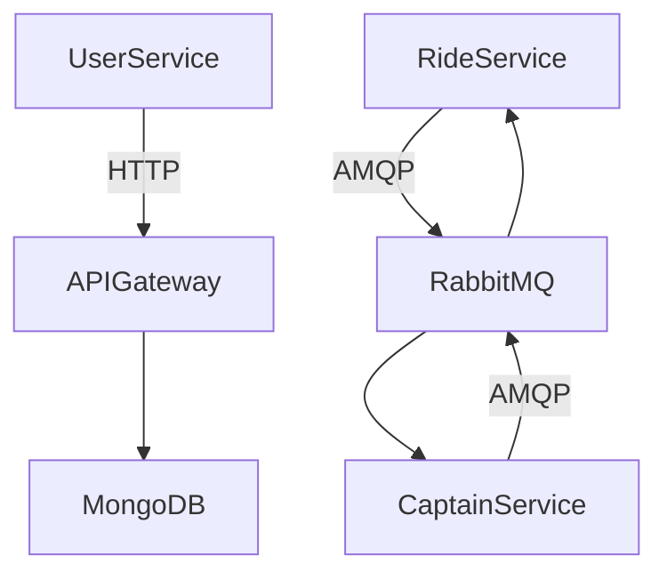

<p align="center">
  
</p>


  <a href="https://github.com/shubechavan/microservices/stargazers">
    
  </a>
  <a href="https://github.com/shubechavan/microservices/network/members">
    
  </a>
  <a href="https://github.com/shubechavan/microservices/issues">
    
  </a>
  <a href="https://github.com/shubechavan/microservices/blob/main/LICENSE">
    
  </a>

</div>

---

## 🎯 Project Overview

**Microservices** is a modular, scalable backend architecture powered by Node.js, Express, MongoDB, RabbitMQ, and a clean service separation model. It’s designed to be **enterprise-grade**, highly **extensible**, and **easy to scale** horizontally.

---

## ⚡️ Key Features

- 🌐 **Microservices-first**: Services like `user`, `ride`, `captain`, and `gateway` are separated for clean scaling and ownership.
- 📬 **RabbitMQ Messaging**: Async message-based architecture with pub/sub pattern.
- 🔐 **Authentication Middleware**: Auth across services with token validation.
- 📁 **Mongoose ODM**: MongoDB schema-driven models for data consistency.
- 🧠 **Smart Logging**: Logs, queues, and events designed for observability.
- ⚙️ **Configurable Environment**: Easily switch between dev, staging, and prod.

---

## 📦 Services Structure

```

/microservices
│
├── captain/
│   └── All captain-related logic, models, controllers
├── ride/
│   └── Ride booking, acceptance, and status flows
├── user/
│   └── Auth, token mgmt, user creation
├── gateway/
│   └── Central API entrypoint with reverse routing

````

---

## 🚀 Quick Start

### 🔧 Prerequisites

- Node.js v14+
- MongoDB running locally or via Atlas
- RabbitMQ running locally or via Docker

### ⚙️ Setup

```bash
# Clone the project
git clone https://github.com/shubechavan/microservices.git
cd microservices

# Copy environment variables
cp .env.example .env

# Install dependencies (repeat for each service)
cd ride && npm install
cd ../captain && npm install
cd ../user && npm install
cd ../gateway && npm install
````

### 📡 Start Services

```bash
# Start RabbitMQ (if using Docker)
docker run -d --hostname rabbit --name rabbitmq -p 5672:5672 rabbitmq:3

# Start services
cd ride && npm start
cd ../captain && npm start
cd ../user && npm start
cd ../gateway && npm start
```

---

## 🛠️ .env Example

```env
MONGO_URI=mongodb://localhost:27017/rideDB
RABBITMQ_URI=amqp://localhost
JWT_SECRET=yourSecretKey
PORT=3001
```

> ⚠️ Each service can have its own `.env`. Keep configs modular.

---

## 📚 Documentation

* [📘 Installation Guide](https://github.com/shubechavan/microservices/wiki/Installation-Guide)
* [⚙️ Configuration Guide](https://github.com/shubechavan/microservices/wiki/Configuration-Guide)
* [🧪 API Documentation](https://github.com/shubechavan/microservices/wiki/API-Documentation)

---

## 📸 Screenshots

| Feature           | Preview                         |
| ----------------- | ------------------------------- |
| API Gateway Logs  |       |
| Ride Service Flow |  |

> 🔄 Replace with actual screenshots when ready!

---

## 🧠 Architecture Diagram



---

## 🤝 Contributing

Contributions are welcome!
Please read our [Contributing Guide](https://github.com/shubechavan/microservices/blob/main/CONTRIBUTING.md).

---

## 📄 License

This project is licensed under the [MIT License](https://github.com/shubechavan/microservices/blob/main/LICENSE).

---

## 💬 Let's Connect

Got ideas? Feedback? Bugs?
Hit me up on [GitHub](https://github.com/shubechavan) or open an [issue](https://github.com/shubechavan/microservices/issues).

---

## 🔍 Tags

`nodejs` `express` `microservices` `mongodb` `rabbitmq` `system-design`  `cloud` `api-gateway`

---

## 🏁 Built With


```

---

